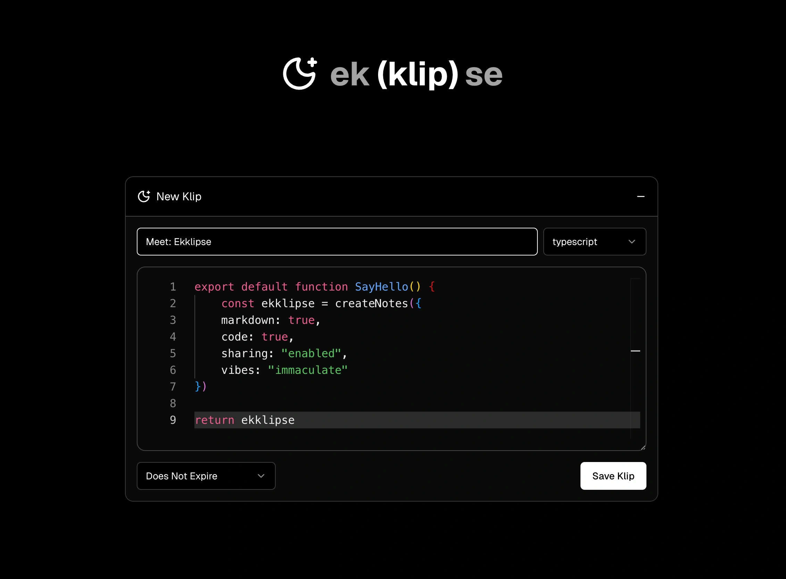

# ekklipse

ekklipse is a simple pastebin app to share links, code, or other text with your friends, colleagues, or yourself on another device.



## Getting Started

Add Ekklipse to your existing Docker lab:

```yaml
services:
  ekklipse:
    platform: linux/amd64 # Backend requires amd64
    image: ekkolyth/ekklipse:latest
    container_name: ekklipse
    ports:
      - "${WEBUI_PORT:-3000}:3000" # Frontend
      - "${API_PORT:-3210}:3210" # Backend API
    environment:
      - APP_URL=${APP_URL:-http://localhost}
      - API_PORT=${API_PORT:-3210}
      - WEBUI_PORT=${WEBUI_PORT:-3000}
    env_file:
      - .env
    volumes:
      - ekklipse-data:/convex/data
    restart: unless-stopped

volumes:
  ekklipse-data:
    driver: local
```

## Contributing

This is a [Tanstack Start](https://tanstack.com/start/latest) project built on top of Convex. It's intentionally feature-lite, but ideas and PR's are welcome!

1. Fork this repo
2. Make your changes
3. Submit a PR

Run the development server:

```bash
bun dev
```

Dev Server: [http://localhost:3000](http://localhost:3000)
